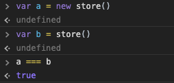

## 为什么要封装代码？

我们经常听说：“写代码要有良好的封装，要高内聚，低耦合”。那怎样才算良好的封装，我们为什么要封装呢？其实封装有这样几个好处：

> 1. 封装好的代码，内部变量不会污染外部。
> 2. 可以作为一个模块给外部调用。外部调用者不需要知道实现的细节，只需要按照约定的规范使用就行了。
> 3. 对扩展开放，对修改关闭，即开闭原则。外部不能修改模块，既保证了模块内部的正确性，又可以留出扩展接口，使用灵活。

## 怎么封装代码？

JS生态已经有很多模块了，有些模块封装得非常好，我们使用起来很方便，比如jQuery，Vue等。如果我们仔细去看这些模块的源码，我们会发现他们的封装都是有规律可循的。这些规律总结起来就是设计模式，用于代码封装的设计模式主要有`工厂模式`，`创建者模式`，`单例模式`，`原型模式`四种。下面我们结合一些框架源码来看看这四种设计模式：

## 工厂模式

工厂模式的名字就很直白，封装的模块就像一个工厂一样批量的产出需要的对象。常见工厂模式的一个特征就是调用的时候不需要使用`new`，而且传入的参数比较简单。但是调用次数可能比较频繁，经常需要产出不同的对象，频繁调用时不用`new`也方便很多。一个工厂模式的代码结构如下所示:

```javascript
function factory(type) {
  switch(type) {
    case 'type1':
      return new Type1();
    case 'type2':
      return new Type2();
    case 'type3':
      return new Type3();
  }
}
```

上述代码中，我们传入了`type`，然后工厂根据不同的`type`来创建不同的对象。

### 实例: 弹窗组件

下面来看看用工厂模式的例子，假如我们有如下需求：

> 我们项目需要一个弹窗，弹窗有几种：消息型弹窗，确认型弹窗，取消型弹窗，他们的颜色和内容可能是不一样的。

针对这几种弹窗，我们先来分别建一个类：

```javascript
function infoPopup(content, color) {}
function confirmPopup(content, color) {}
function cancelPopup(content, color) {}
```

如果我们直接使用这几个类，就是这样的:

```javascript
let infoPopup1 = new infoPopup(content, color);
let infoPopup2 = new infoPopup(content, color);
let confirmPopup1 = new confirmPopup(content, color);
...
```

每次用的时候都要去`new`对应的弹窗类，我们用工厂模式改造下，就是这样：

```javascript
// 新加一个方法popup把这几个类都包装起来
function popup(type, content, color) {
  switch(type) {
    case 'infoPopup':
      return new infoPopup(content, color);
    case 'confirmPopup':
      return new confirmPopup(content, color);
    case 'cancelPopup':
      return new cancelPopup(content, color);
  }
}
```

然后我们使用`popup`就不用`new`了，直接调用函数就行:

```javascript
let infoPopup1 = popup('infoPopup', content, color); 
```

### 改造成面向对象

上述代码虽然实现了工厂模式，但是`switch`始终感觉不是很优雅。我们使用面向对象改造下`popup`，将它改为一个类，将不同类型的弹窗挂载在这个类上成为工厂方法：

```javascript
function popup(type, content, color) {
  // 如果是通过new调用的，返回对应类型的弹窗
  if(this instanceof popup) {
    return new this[type](content, color);
  } else {
    // 如果不是new调用的，使用new调用，会走到上面那行代码
    return new popup(type, content, color);
  }
}

// 各种类型的弹窗全部挂载在原型上成为实例方法
popup.prototype.infoPopup = function(content, color) {}
popup.prototype.confirmPopup = function(content, color) {}
popup.prototype.cancelPopup = function(content, color) {}
```

### 封装成模块

这个`popup`不仅仅让我们调用的时候少了一个`new`，他其实还把相关的各种弹窗都封装在了里面，这个`popup`可以直接作为模块`export`出去给别人调用，也可以挂载在`window`上作为一个模块给别人调用。因为`popup`封装了弹窗的各种细节，即使以后`popup`内部改了，或者新增了弹窗类型，或者弹窗类的名字变了，只要保证对外的接口参数不变，对外面都没有影响。挂载在`window`上作为模块可以使用自执行函数：

```javascript
(function(){
 	function popup(type, content, color) {
    if(this instanceof popup) {
      return new this[type](content, color);
    } else {
      return new popup(type, content, color);
    }
  }

  popup.prototype.infoPopup = function(content, color) {}
  popup.prototype.confirmPopup = function(content, color) {}
  popup.prototype.cancelPopup = function(content, color) {}
  
  window.popup = popup;
})()

// 外面就直接可以使用popup模块了
let infoPopup1 = popup('infoPopup', content, color); 
```

### jQuery的工厂模式

jQuery也是一个典型的工厂模式，你给他一个参数，他就给你返回符合参数DOM对象。那jQuery这种不用`new`的工厂模式是怎么实现的呢？其实就是jQuery内部帮你调用了`new`而已，jQuery的调用流程简化了就是这样:

```javascript
(function(){
  var jQuery = function(selector) {
    return new jQuery.fn.init(selector);   // new一下init, init才是真正的构造函数
  }

  jQuery.fn = jQuery.prototype;     // jQuery.fn就是jQuery.prototype的简写

  jQuery.fn.init = function(selector) {
    // 这里面实现真正的构造函数
  }

  // 让init和jQuery的原型指向同一个对象，便于挂载实例方法
  jQuery.fn.init.prototype = jQuery.fn;  

  // 最后将jQuery挂载到window上
  window.$ = window.jQuery = jQuery;
})();
```

上述代码结构来自于jQuery源码，从中可以看出，你调用时省略的`new`在jQuery里面帮你调用了，目的是为了使大量调用更方便。但是这种结构需要借助一个`init`方法，最后还要将`jQuery`和`init`的原型绑在一起，其实还有一种更加简便的方法可以实现这个需求:

```javascript
var jQuery = function(selector) {
  if(!(this instanceof jQuery)) {
    return new jQuery(selector);
  }
  
  // 下面进行真正构造函数的执行
}
```

上述代码就简洁多了，也可以实现不用`new`直接调用，这里利用的特性是`this`在函数被`new`调用时，指向的是`new`出来的对象，`new`出来的对象自然是类的`instance`，这里的`this instanceof jQuery`就是`true`。如果是普通调用，他就是`false`，我们就帮他`new`一下。

## 建造者模式

建造者模式是用于比较复杂的大对象的构建，比如`Vue`，`Vue`内部包含一个功能强大，逻辑复杂的对象，在构建的时候也需要传很多参数进去。像这种需要创建的情况不多，创建的对象本身又很复杂的时候就适用建造者模式。建造者模式的一般结构如下：

```javascript
function Model1() {}   // 模块1
function Model2() {}   // 模块2

// 最终使用的类
function Final() {
  this.model1 = new Model1();
  this.model2 = new Model2();
}

// 使用时
var obj = new Final();
```

上述代码中我们最终使用的是`Final`，但是`Final`里面的结构比较复杂，有很多个子模块，`Final`就是将这些子模块组合起来完成功能，这种需要精细化构造的就适用于建造者模式。

### 实例：编辑器插件

假设我们有这样一个需求：

> 写一个编辑器插件，初始化的时候需要配置大量参数，而且内部的功能很多很复杂，可以改变字体颜色和大小，也可以前进后退。

一般一个页面就只有一个编辑器，而且里面的功能可能很复杂，可能需要调整颜色，字体等。也就是说这个插件内部可能还会调用其他类，然后将他们组合起来实现功能，这就适合建造者模式。我们来分析下做这样一个编辑器需要哪些模块:

> 1. 编辑器本身肯定需要一个类，是给外部调用的接口
> 2. 需要一个控制参数初始化和页面渲染的类
> 3. 需要一个控制字体的类
> 4. 需要一个状态管理的类

```javascript
// 编辑器本身，对外暴露
function Editor() {
  // 编辑器里面就是将各个模块组合起来实现功能
  this.initer = new HtmlInit();
  this.fontController = new FontController();
  this.stateController = new StateController(this.fontController);
}

// 初始化参数，渲染页面
function HtmlInit() {
  
}
HtmlInit.prototype.initStyle = function() {}     // 初始化样式
HtmlInit.prototype.renderDom = function() {}     // 渲染DOM

// 字体控制器
function FontController() {
  
}
FontController.prototype.changeFontColor = function() {}    // 改变字体颜色
FontController.prototype.changeFontSize = function() {}     // 改变字体大小

// 状态控制器
function StateController(fontController) {
  this.states = [];       // 一个数组，存储所有状态
  this.currentState = 0;  // 一个指针，指向当前状态
  this.fontController = fontController;    // 将字体管理器注入，便于改变状态的时候改变字体
}
StateController.prototype.saveState = function() {}     // 保存状态
StateController.prototype.backState = function() {}     // 后退状态
StateController.prototype.forwardState = function() {}     // 前进状态
```

上面的代码其实就将一个编辑器插件的架子搭起来了，具体实现功能就是往这些方法里面填入具体的内容就行了，其实就是各个模块的相互调用，比如我们要实现后退状态的功能就可以这样写:

```javascript
StateController.prototype.backState = function() {
  var state = this.states[this.currentState - 1];  // 取出上一个状态
  this.fontController.changeFontColor(state.color);  // 改回上次颜色
  this.fontController.changeFontSize(state.size);    // 改回上次大小
}
```

## 单例模式

单例模式适用于全局只能有一个实例对象的场景，单例模式的一般结构如下：

```javascript
function Singleton() {}

Singleton.getInstance = function() {
  if(this.instance) {
    return this.instance;
  }
  
  this.instance = new Singleton();
  return this.instance;
}
```

上述代码中，`Singleton`类挂载了一个静态方法`getInstance`，如果要获取实例对象只能通过这个方法拿，这个方法会检测是不是有现存的实例对象，如果有就返回，没有就新建一个。

### 实例：全局数据存储对象

假如我们现在有这样一个需求:

> 我们需要对一个全局的数据对象进行管理，这个对象只能有一个，如果有多个会导致数据不同步。

这个需求要求全局只有一个数据存储对象，是典型的适合单例模式的场景，我们可以直接套用上面的代码模板，但是上面的代码模板获取`instance`必须要调`getInstance`才行，要是某个使用者直接调了`Singleton()`或者`new Singleton()`就会出问题，这次我们换一种写法，让他能够兼容`Singleton()`和`new Singleton()`，使用起来更加傻瓜化:

```javascript
function store() {
  if(store.instance) {
    return store.instance;
  }
  
  store.instance = this;
}
```

上述代码支持使用`new store()`的方式调用，我们使用了一个静态变量`instance`来记录是否有进行过实例化，如果实例化了就返回这个实例，如果没有实例化说明是第一次调用，那就把`this`赋给这个这个静态变量，因为是使用`new`调用，这时候的`this`指向的就是实例化出来的对象，并且最后会隐式的返回`this`。

如果我们还想支持`store()`直接调用，我们可以用前面工厂模式用过的方法，检测`this`是不是当前类的实例，如果不是就帮他用`new`调用就行了：

```javascript
function store() {
  // 加一个instanceof检测
  if(!(this instanceof store)) {
    return new store();
  }
  
  // 下面跟前面一样的
  if(store.instance) {
    return store.instance;
  }
  
  store.instance = this;
}
```

然后我们用两种方式调用来检测下:



### 实例：vue-router

`vue-router`其实也用到了单例模式，因为如果一个页面有多个路由对象，可能造成状态的冲突，`vue-router`的单例实现方式又有点不一样，[下列代码来自`vue-router`源码](https://github.com/vuejs/vue-router/blob/dev/src/install.js)：

```javascript
let _Vue;

function install(Vue) {
  if (install.installed && _Vue === Vue) return;
  install.installed = true

  _Vue = Vue
}
```

每次我们调用`vue.use(vueRouter)`的时候其实都会去执行`vue-router`模块的`install`方法，如果用户不小心多次调用了`vue.use(vueRouter)`就会造成`install`的多次执行，从而产生不对的结果。`vue-router`的`install`在第一次执行时，将`installed`属性写成了`true`，并且记录了当前的`Vue`，这样后面在同一个`Vue`里面再次执行`install`就会直接`return`了，这也是一种单例模式。

可以看到我们这里三种代码都是单例模式，他们虽然形式不一样，但是核心思想都是一样的，都是用一个变量来标记代码是否已经执行过了，如果执行过了就返回上次的执行结果，这样就保证了多次调用也会拿到一样的结果。

## 原型模式

原型模式最典型的应用就是JS本身啊，JS的原型链就是原型模式。JS中可以使用`Object.create`指定一个对象作为原型来创建对象:

```javascript
const obj = {
  x: 1,
  func: () => {}
}

// 以obj为原型创建一个新对象
const newObj = Object.create(obj);

console.log(newObj.__proto__ === obj);    // true
console.log(newObj.x);    // 1
```

上述代码我们将`obj`作为原型，然后用`Object.create`创建的新对象都会拥有这个对象上的属性和方法，这其实就算是一种原型模式。还有JS的面向对象其实更加是这种模式的体现，比如JS的继承可以这样写:

```javascript
function Parent() {
  this.parentAge = 50;
}
function Child() {}

Child.prototype = new Parent();
Child.prototype.constructor = Child;      // 注意重置constructor

const obj = new Child();
console.log(obj.parentAge);    // 50
```

这里的继承其实就是让子类`Child.prototype.__proto__`的指向父类的`prototype`，从而获取父类的方法和属性。[JS中面向对象的内容较多，我这里不展开了，有一篇文章专门讲这个问题](https://juejin.im/post/5e50e5b16fb9a07c9a1959af)。

## 总结

1. 很多用起来顺手的开源库都有良好的封装，封装可以将内部环境和外部环境隔离，外部用起来更顺手。
2. 针对不同的场景可以有不同的封装方案。
3. 需要大量产生类似实例的组件可以考虑用工厂模式来封装。
4. 内部逻辑较复杂，外部使用时需要的实例也不多，可以考虑用建造者模式来封装。
5. 全局只能有一个实例的需要用单例模式来封装。
6. 新老对象之间可能有继承关系的可以考虑用原型模式来封装，JS本身就是一个典型的原型模式。
7. 使用设计模式时不要生搬硬套代码模板，更重要的是掌握思想，同一个模式在不同的场景可以有不同的实现方案。

**文章的最后，感谢你花费宝贵的时间阅读本文，如果本文给了你一点点帮助或者启发，请不要吝啬你的赞和GitHub小星星，你的支持是作者持续创作的动力。**

**作者博文GitHub项目地址： [https://github.com/dennis-jiang/Front-End-Knowledges](https://github.com/dennis-jiang/Front-End-Knowledges)**

**作者掘金文章汇总：[https://juejin.im/post/5e3ffc85518825494e2772fd](https://juejin.im/post/5e3ffc85518825494e2772fd)**