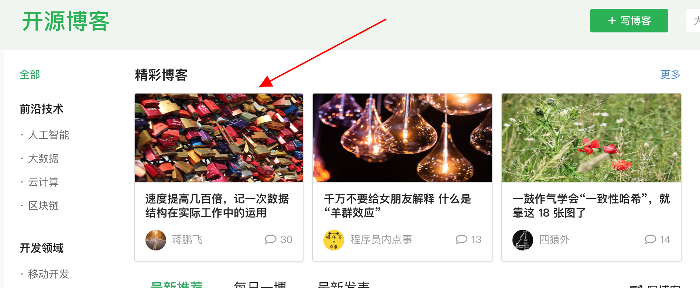
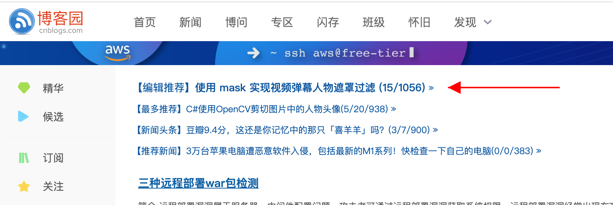

# 技术写作技巧分享：我是如何从写作小白成长为多平台优秀作者的？

我从事技术写作的时间其实不长，开始写作的时间就是我掘金账号注册的时间：


到今天(2021年2月23日)也就是一年零一个月，这一年的收获是超过我的预期的：

1. 产出博文四十多篇，总共数十万字
2. [掘金优秀作者，掘金年度人气作者No.27](https://juejin.cn/user/2295436011645655)
3. [思否2020年度"Top Writer"](https://segmentfault.com/a/1190000038796132)，[万粉专栏作者](https://segmentfault.com/blog/dennis-jiang)
4. 开源中国优秀源创作者，[源创计划年度活跃博主 Top20](https://www.oschina.net/best-2020)

本文想对这个历程做一个回顾，并分享一下我总结的写作技巧以及推广策略。

## 为什么写作

在写作之前想清楚为什么写作非常重要！因为你最初的想法会决定你往哪个方向去写，写出的内容的质量怎么样。

我写作的原因很简单，就是我前端做了几年了，大部分时间都在写业务代码，技术上一直没有太大的突破，最多也就是换个框架，换个UI库，换来换去始终感觉似曾相识。为了不让几年工作经验成为“第一年工作经验的复制品”，我决定再深入，系统的学习下前端知识。所以对于我来说，写作是我的学习方法，我的首要目的是学习知识，写作带来的社区声望只是附带的，有了当然好，没有也没必要刻意去刷。

### “为学习而写”与“为刷声望而写”

根据我的观察，社区上的作者写作目的主要分为两种：“为学习而写”与“为刷声望而写”。

大部分厉害的大佬其实都是“为学习而写”，就是他们看到什么好玩的，新奇的技术，去学习了，自然而然的总结出文章。或者觉得某个知识点大家很容易搞错，想输出自己的观点，帮大家避坑，就将自己的见解写成文章，这个过程作者虽然更多的是在输出内容，但是写作的过程其实也会强化作者自己的理解，其实也是一个学习方法。我个人认为“为学习而写”写出的文章才是正道，是社区良性发展的方向。

当然也有少部分作者想在短时间内获取更多关注而刻意的去迎合读者口味，也就是“为刷声望而写”。比较典型的一个例子就是，掘金曾经在某段时期被大量的面试题汇总占据。大家出去面试了回来分享下心得其实是好事，但是刻意的去搜集面试题，相似的内容发了一遍又一遍，里面的答案甚至还是错的，会导致社区越来越功利，低质量面试题霸版，高质量技术文章反而没机会展示，从而造成劣币驱逐良币的现象。我记得那会儿有个作者靠反复发面试题，短时间就刷了三四千掘力值，眼看就要到“优秀作者”了，结果被一个社区大佬怼了，然后就没怎么露面了。这样，前面刷的几千声望不是都白费了吗？后来掘金官方也整治了低质量的面试题文章，现在的情况已经好多了。

所以我说，写作前想清楚“为学习而写”与“为刷声望而写”很重要，如果是“为学习而写”，那就可以写出自己的心得体会，写出高质量文章，如果单纯是“为刷声望而写”，可能短期会有点收益，但是也有可能会被大佬怼，被官方整治，前功尽弃。

## 写什么

在这个“系统学习计划”开始之前，我其实没怎么写过技术文章，甚至都没怎么逛过技术社区。平时如果需要学习一个东西，比如学习`React`，那我会直接去它的官方网站，把它的文档全部读一遍，现在这些流行库的文档都写的很好，看一遍基本就能上手了。如果看完了还是不太知道怎么用，那就去公司看看有没有项目用过，公司没用过，就去GitHub上找找，然后抄抄改改就能上手了。这个过程一般也就几天，复杂的库最多也就一两周就能上手。使用的时候遇到问题就用Google搜，基本都会找到Stack Overflow上，答案拿过来一用就行。

前面几年我的工作模式基本都是这样的，这样应付工作也没啥问题，但是第一年是这样，第二年是这样，第n年还是这样。。。就成了“一年工作经验复用n年”，成了名副其实的“API工程师”，做项目没问题，问原理似曾相识，但是却说不太清楚。如果一直这样，技术就会一直原地踏步，在现单位很容易被替代，出去找工作也可能会四处碰壁，或者找来找去找到的始终跟当前的差不多，很难实现大的突破。

我感到，我碰到瓶颈了。我想突破这个瓶颈，但是我不知道怎么做！在没有具体方向的时候，就看看手上能做啥吧，从简单的，可见的开始做。于是，我决定，我要重头整理自己的知识框架，把那些只是似曾相似的技术，原理全部吃透，于是我从网上找了一份“前端知识架构图谱”，决定按照里面的提纲，全部重新学习一遍。只是我再次学习不能是简单的看看书，看看博客，看看视频就行了，这种事情我以前干过了，作为一个有几年工作经验的前端，我对自己有更高的要求：**所有学过的知识点，必须自己全部写成文章进行巩固；所有框架的学习，必须学到原理或者源码层面**！

所以，“写什么”这个问题的答案已经有了：**学习前端知识架构，将学习过程写成文章**。

## 怎么写

上面说了，我其实并没有什么写作经验，我最近一次写作是大学论文，再往前就是高中作文了，写作水平其实不咋地。但是技术写作跟普通作文不一样，一般不需要华丽的辞藻，更重要的是要把问题讲清楚，看技术文章的读者需要的是学习技术知识，而不是看风花雪月，所以技术文章的逻辑，层级递进，由浅入深，好理解其实更重要。我刚开始时也不知道怎么写，也是在不断写作工程中，一边写，一边总结，整体来说，我自己的文章其实都分了好几个阶段：

1. 就是记个笔记
2. 有自己理解的知识点解析
3. 深入源码，探究原理
4. 从工作中总结

### 就是记个笔记

从小学开始，老师就会让大家记笔记，大家应该都会，这也是最简单的切入点。我刚开始的时候，不会写文章，写的基本都是笔记，比如[各种CSS居中方案](https://juejin.cn/post/6844904058193444871)，这就是我在其他地方学的，然后把他记录下来，也就是个笔记而已。对于“CSS居中”这种问题来说，面试问烂了，网上资料也是一大堆，这篇文章也没什么出彩的地方，所以关注的人不多。其实对于“笔记型”来说，获取关注少是很容易理解的，因为你写的东西是笔记，也就是说你也是从其他地方学来的，整个文章的思路其实也是人家的，如果自己记笔记的水平不高，可能写出来的效果还不如原文章。

### 有自己理解的知识点解析

在写了一些“笔记型”文章后，我发现效果不好，不仅仅是没什么人关注，甚至对自己帮助也不大。经常是写了没多久就忘了，需要的时候还要回过头来看看笔记，我开始意识到，这个现象的本质是，你写的东西是笔记，核心思想都是人家的，或者是自己东拼西凑的，整篇文章没有自己的逻辑，没有自己的见解。于是，我开始尝试在文章中加入自己的见解，当时正好组内有小伙伴对“JS原型链”理解的不是很透彻，网上虽然有很多类似文章，但是很多都是从表面来解释“原型链是什么”，画的图也很复杂，不是很好理解。于是我尝试自己写一篇原型链的文章，因为我知道他可以实现“面向对象”的特征，这是很多其他文章都没怎么提的，但却是设计者最初可能想要实现的效果，于是我类比Java的面向对象，从面向对象的角度讲述了原型链的作用以及他存在的意义，就是这个：[轻松理解JS中的面向对象，顺便搞懂prototype和__proto__](https://juejin.cn/post/6844904069887164423)。这篇文章上了掘金首页推荐，最终获得了两百多赞，一万多阅读，这让我开始意识到，“有自己理解的知识点解析”在掘金可能更受欢迎。

在这之后，我开始有意识的在整理知识架构时加入自己的见解。那对于一个知识点，怎么产生自己的见解呢？这需要在学习时多问自己几个问题！比如，学习HTTPS时，除了跟大家一样搞清楚HTTPS的加解密流程，握手过程外，我问了自己一个问题：“HTTPS有没有可能被破解？假如我是个黑客，如果我想破解HTTPS，有哪些方法和途径？”带着这个问题，我从“破解HTTPS”的角度讲述了HTTPS的原理，这篇文章也上了推荐，获得了一百多赞和好几千阅读：[RSA初探，聊聊怎么破解HTTPS](https://juejin.cn/post/6844904087205445640)。

尝到点甜头后，我更加注意在学习中反问自己问题，加入自己理解了。有时候在学习别人的东西时，我发现了别人没发现的一些点，也可以从这个角度加入自己的独到见解，写成自己的文章，比如某视频课程在讲述JS的事件循环时说：“`setImmediate`比`setTimeout`先执行”。听到这句话，我敏锐的感觉不太对，因为我曾经遇到过`setTimeout`比`setImmediate`先执行的情况，但是具体是啥情况我一时想不起来。于是我花了点时间把这个问题和原理彻底弄清楚了，并写成了自己的文章：[setTimeout和setImmediate到底谁先执行，本文让你彻底理解Event Loop](https://juejin.cn/post/6844904100195205133)。这篇文章最终也获得了一百多赞，大几千阅读~

### 深入源码，探究原理

JS知识体系虽然庞大，但是终究是有限的，很快我就写了十几篇JS的文章，内容包含了内存管理，深浅拷贝，面向对象(原型链)，`this`指向，事件循环，变量类型，作用域等等。这些已经囊括了JS的主要知识点，JS上我已经很难找到新的写文章的点了。

于是我的文章内容开始转向我使用的框架，这几年我主要使用的`React`技术栈。于是我准备重新整理学习`React`技术栈，当然不是学习他的用法了，毕竟我用了几年了，用法早就熟悉了，这次我要学的是他们的源码和原理。源码和原理相对于JS知识和框架使用方法来说要难得多，受众也小的多，对于读者来说也很难产生直接的收益。因为读者可能看个JS知识点，出去面试就能应付大部分的JS面试了，除了些大厂外，也不是每个公司面试都会问源码，而且这些受欢迎的开源库是各位大牛努力写作的成果，里面汇聚了各种JS的高级用法，各种高级编程思想和设计模式，所以即使我尽量写得深入浅出，层层递进，相较于其他文章来说仍然会显得更加晦涩难读。所以这类文章在掘金获得的赞和阅读并不可观，我大量的源码解析都只有三四十个赞，这里面还有一半左右是我厚脸求朋友同事们点的(这点我后面在讲推广的时候会说)。

对于作者来说，写源码类文章需要去读框架源码，也会很花时间。我写一个JS知识点的文章，因为东西都是我熟悉的，可能几天就搞定了，写完了还会有上百的赞。但是一个复杂框架的源码解析，比如`Express.js`，我需要一点点的去读，去调试源码，成文可能需要两三周，写完后可能仍然只有三四十个赞。从社区声望增长这个角度来说，性价比极低！**但是我一直没有放弃这类文章，甚至现在成了我主要的写作方向。为什么？因为人总要突破自己的舒适区，探索未知的领域，最终才能学习到东西，获得成长**！这其实回到了文章开头就提出的问题：“你为什么要写技术文章？”对于我来说，这是我学习的途径，所以如果这个过程我能够学到东西，能够感受到成长，我就会坚持去做，即使他在其他方面性价比很低！另外我的源码类文章虽然在掘金反响不是很好，但是在其他平台，比如思否，还可以，所以其实也是有回报的。

好了，说了这么多为什么要写源码解析，现在来谈谈怎么写源码解析。前面说了，在我从事技术写作之前，我基本不懂源码，是名副其实的“API工程师”，那会儿我也是一提到源码就心慌，完全不知道从何下手。后来我忐忑的打破自己的心理障碍，多次尝试之后找到了一个看源码的套路。其实再🐂的框架或库本质也是JS代码，所以我们可以用一种简单质朴的方法去读，这其实也是大家经常在用的方法。想象这样一个场景，你们公司一个运行很久的项目出了点问题，你领导让你去调查下。由于这个项目你之前没有参与，现在贸然叫你去解决BUG，你是不是要先反复复现问题，然后找到相关的代码块，调试这些代码并找到BUG原因，然后将它修复。看源码的时候我们完全可以用类似的思路去看，先缩小范围，只看这个库的核心代码。比如`Koa.js`核心用法其实只有这么点：

```javascript
const Koa = require('koa');
const app = new Koa();

app.use(async ctx => {
  ctx.body = 'Hello World';
});

app.listen(3000);
```

你就把它当成你现在需要接手的老项目，为了弄懂他的运行逻辑，看看这段代码里面他暴露了哪些API，然后一个一个去调试下就行了。就上面这几行代码而言，其实只有三个API：

1. `Koa`类
2. `app.use`实例方法
3. `app.listen`实例方法

花点时间去源码里面找到这三个API，并看看他们是怎么实现的，在看的时候，把主要逻辑剥离出来，自己实现一遍，同时把整个过程记录下来。等你把这三个API实现都看懂了，其实一篇源码解析的文章也就出来了，同时还可以产出一个迷你版`Koa`：[手写Koa.js源码](https://juejin.cn/post/6892952604163342344)。

### 从工作中总结

其实很多公司都不是技术驱动的，技术只是实现业务的一个手段而已，这就造成很多公司的一个项目都是从另一个项目抄抄改改就能用，很多人(包括我)在这种环境下待久了，慢慢就成了“API工程师”，最熟悉的其实是CV大法。但是每个公司的业务其实在某方面都有自己一定的独到性，不然也活不下来，在实现这些比较复杂的业务时，有时候我们也会用一些比较有意思的方法，有时候我们可能花了很多时间去实现他，但是过后又慢慢淡忘了。其实对于这些有一定技术含量的工作，我们也可以总结下，然后写成文章，慢慢沉淀下来成为自己的技术。我就从工作中总结了三篇文章，有的反响还不错：

1. [速度提高几百倍，记一次数据结构在实际工作中的运用](https://juejin.cn/post/6898569107877134350)
2. [使用mono-repo实现跨项目组件共享](https://juejin.cn/post/6913788953971654663)
3. [歪门邪道性能优化：魔改三方库源码，性能提高几十倍！](https://juejin.cn/post/6922684424488222727)

## 推广

有句俗话说：“酒香不怕巷子深”。但是这个并不适用于现在的互联网时代，互联网时代是信息爆炸的时代，如果没有适度的推广，即使你的内容很好，最终也会淹没在信息的洪流里面。好内容的推广对于社区，读者和作者来说其实是三赢的。

对于社区来说，如果有大量优质内容提供给读者，口碑就会很好，读者会愿意长期待在这个社区学习，并可能会主动推荐给朋友。所以很多社区的编辑很大一部分工作就是主动发掘好的内容，并推送给更多的用户。

对于读者来说，好内容的推广可以学习到更多东西，而不是整天被一些低质量内容霸屏。

对于作者来说，好内容的推广可以获得更多关注，更多的社区声望，激发创作热情，从而形成正向激励，产出更多高质量内容。

但是推广有一个很大的前提：**推广的内容一定要是高质量的内容，不然会起反效果**。

所以我的技术写作，我也尝试了多种推广方式和渠道，不同的方式效果不一样，我用过的方式主要有：

1. 各种QQ群，微信群分享
2. 找朋友，同事帮忙点赞
3. 找社区编辑帮忙推荐
4. 多平台发布
5. 文章相互引用
6. 运营微信公众号

下面就这些详细讲述下：

### 推广的前提是高质量

在推广之前，一定要确保你推广的内容的质量，至少要是你用心写的，也许你现在只是一个初学者，写不出高深内容，但是你写的内容一定要是你用心写的，要让读者感受到你的诚意。如果只是简单的面试题拼凑，甚至里面的答案都是错的，你还拼命去推广，你推广的越多，只会让更多人知道你写的东西不好，没诚意，可能还会被很多人留言怼。就像开头提到的那个例子，如果一味的为了“刷声望”而去拼凑内容，大量推广，你声望可能会涨得很快，但是，同时也会让大量的人知道，你写的东西不行，没诚意，甚至可能被大佬怼到不敢露面。

### QQ群，微信群分享

我开始写文章时喜欢写完了就分享到一些QQ群和微信群，但是效果并不好。经常是分享到一个几百人的群，过一会儿去看，阅读量涨了几百，但是赞一个没有。。。当然也可能是我早期的“笔记型”文章质量不高，所以获赞不多，比如前面提到过的[各种CSS居中方案](https://juejin.cn/post/6844904058193444871)，我就分享到过很多群，最终有三千多阅读，但是赞只有三十来个。。。所以我现在已经基本不乱分享了，收益太低，还可能被当成打广告的遭嫌弃。

### 找朋友，同事帮忙点赞

这条主要是针对掘金平台的，因为掘金的赞多了可以升级，升到4级就是“优秀作者”，可以自动上首页。所以我在掘金发布后，会分享给关系好的同事和同学，因为关系很好，他们基本都会帮忙点个👍。但是这部分老铁人不多，总共也就十几个。

### 找社区编辑推荐

这其实是效果最好的一个推广渠道，可以联系社区编辑，将写好的文章链接发给他，编辑在审核后，觉得可以的会推荐到社区首页，这会大大提高曝光量。以掘金为例，一般我上首页推荐的文章，至少都会有十来个赞，阅读少说几百上千。加上前面朋友点的赞，我一篇文章最少会有三十来个赞，加上阅读量转换的掘力值，一篇文章至少会有四五十的掘力值。有一段时间，我就以这个为基准在那里算：我再写一百篇就可以升4级了，哈哈😃 当然如果出了爆品，某篇文章获得了成百上千的赞，会大大加速这个进程。

其他社区，比如思否，开源中国，找编辑推荐效果也是非常好的，他们有作者推荐群，可以联系编辑加群，有好的内容就可以发到群里求推荐。

### 多平台发布

中文社区其实还是挺多的，我最开始是在掘金写文章，但是粉丝最多的平台却是思否，个人粉丝将近两千，专栏粉丝一万多。所以你文章写好后，可以发布到多个平台，也许这个平台不火的文章在另一个平台却火了。目前对于我来说效果还不错的平台有：掘金，思否，开源中国和博客园，下面我就这几个平台的特点来细说下：

#### 掘金

掘金最大的特色是等级制度，等级到4级可以解锁成就：掘金优秀作者，然后发布的文章可以自动上首页，可以大大提高曝光量。另外编辑也很负责，会主动寻找优质内容推荐到首页，所以如果你持续输出优质内容，篇篇被推荐也是有可能的。

#### 思否

思否最大的特点是涨粉很快，因为新用户在注册思否时会推荐一些专栏和作者给他关注，如果你足够活跃，就可以进这个推荐列表。思否每年还会评定“Top Writer”，每年15人，因为名额少，所以比掘金的“优秀作者”还难点，如果被评上了“Top Writer”，会有一段时间的流量支持，涨粉更快，我评上后最多的一天涨粉上千。另外思否的技术团队也很负责，有什么问题在群里反馈了很快就能得到回答，有时候CEO还会亲自回复👍。

#### 开源中国

开源中国流量也不错，如果被推荐上首页，至少会有一两千的阅读。另外在他的[博客站点首页](https://www.oschina.net/blog)还有个“精彩博客”栏目，如果出现在这里，可以挂很长时间，下图中这篇文章：[速度提高几百倍，记一次数据结构在实际工作中的运用](https://my.oschina.net/u/4638235/blog/4881259)是我1月6号发布的，到今天，2月23号，一个多月了还排在这个栏目第一，单篇阅读一直在涨，已经有4.7万了。



[而同样一篇文章我也发布到过掘金](https://juejin.cn/post/6898569107877134350)，只有三十来个赞，效果很一般，所以多平台发布还是有好处的，这个平台不火，另一个平台说不定就火了。

#### 博客园

博客园最大的特色是在发布时可以自己选择上首页，当然如果你质量不好，还是可能会被编辑撤下来的，我以前就被撤下来过。因为可以自己决定上首页，所以博客园的首页刷新很快，一会儿就被淹没了，所以单篇阅读量不高，可能只有一两百。但是如果你能获得编辑的特别推荐，出现在这个位置，流量还是可以的：



我有两篇获得过编辑推荐，最多的一篇有近万阅读，少的也有三四千，这个位置只能待一天，所以其实还是不错了。

另外，我还试过CSDN，知乎，腾讯云社区等，因为效果不是很好，已经没怎么运营了。大家早期时可以尽量多发布几个平台，然后看看哪个平台效果好就重点关注，效果不好的就可以放弃了，因为运营平台过多也会耗费大量精力，选性价比高的弄就行。

### 文章内相互引用

因为我写的东西成体系，所以一篇文章B可能会用到以前写的文章A的知识，那我就会在文章B里面引用文章A，这样读者可能就顺着去看文章A了。这样有一定的效果，有时候很久前写的文章会被点赞，就是这么来的。

### 运营微信公众号

我写了一段时间后，会有朋友给我留言，希望转载到微信公众号，这种情况遇到几次后，我就在想，我为啥不自己弄个公众号，于是我就开通了一个公众号[进击的大前端](https://test-dennis.oss-cn-hangzhou.aliyuncs.com/QRCode/QR430.jpg)。听说微信公众号还能赚钱，说不定我还能赚点外快，到目前为止确实有一点点收入：

1. 获得赞赏收入7元，其中5元是我老婆给的
2. 获得广告收入1.84元

这个收入还真是一点点😜，主要是因为我运营比较佛系，发的内容主要是原创，粉丝不多，新增粉丝主要是文章后面的广告和其他号主转发带来的。广告我也只放了文末广告，文中广告都没放，怕影响用户体验。

有一段时间我也想过要不要大力运营，每天转发更新内容，但是每天发内容需要寻找稿子，审核稿子，也需要不少时间。而我目前的主要精力在学习和原创内容上，就没弄了，先佛系运营着吧。

## 总结

本文总结和分享了我这一年从事技术写作的心得体会，对这一年进行了回顾，同时也希望给想往这方面发展的朋友提供一个参考。下面再对内容进行一个简短总结：

1. 从事技术写作的目的最好是**学习和分享**，而不是单纯的刷声望。
2. 写作内容可以是：
   1. **简单的学习笔记**：因为是简单的记录别人的内容，效果可能不是很好
   2. **有自己理解的知识点解析**：有自己见解，也有一定难度，但又不至于晦涩难懂，受众广，在社区容易受欢迎。
   3. **原理和源码解析**：内容较难，受众略小，在社区不一定受欢迎，但是对于自己的成长非常有用。
   4. **从工作中总结**：注意总结工作中有价值的技术内容，而不是做单纯的“API工程师”，在工作中完成技术沉淀，一举两得。
3. 适度的推广是社区，读者和作者的三赢，但是推广的内容一定要是高质量的，不然可能会起反效果，一般推广手段有：
   1. **各种群分享**：效果不好，经常是阅读量涨几百，赞一个没有
   2. **分享给朋友，同事**：早期有用，可以保底有几个赞，但是数量毕竟有限。
   3. **社区编辑推荐**：最有用的方式，可以大幅提高曝光量，但是质量一定要过关才行。
   4. **多平台发布**：写了文章后可以尝试发到多个平台，也许这个平台不火的另一个平台火了。
   5. **文章内相互引用**：有一点效果，可以让很久前写的文章仍然获得少量曝光。
   6. **运营微信公众号**：据说能赚钱，但是我佛系运营，目前总收入不到10块。

**最后感谢各位读者的阅读，点赞**！

**感谢各位公众号号主的转发**！

**感谢掘金，思否，开源中国，博客园等平台的大力支持**！

**你们的支持一直是我持续创作的动力**！


